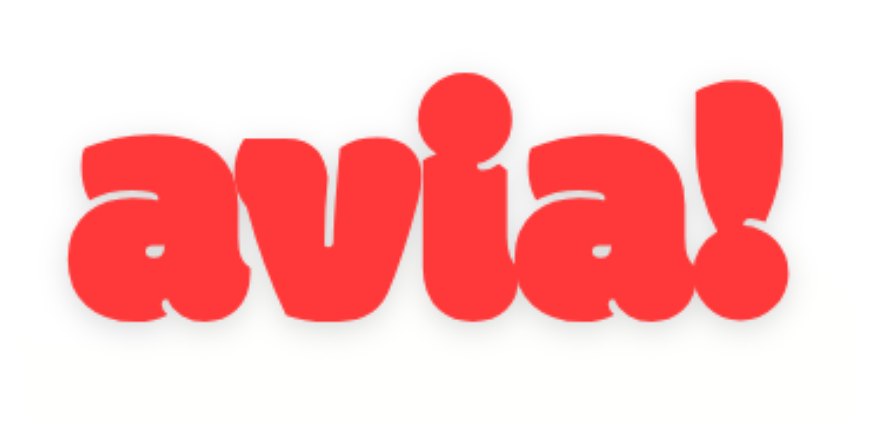
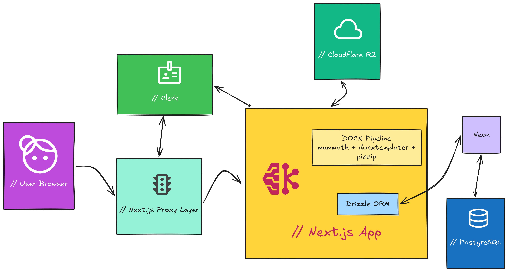

# avia!

<p align="center">
  
</p>

Welcome to **avia!**, a template-driven document generation platform.

---

## Live Demo

Try it at: [https://avia-navy.vercel.app/](https://avia-navy.vercel.app/)

---

## Features

- **Template Management**: Upload and manage `.docx` templates.
- **Dynamic Content**: Fill templates with real-time data.
- **Document Generation**: Generate ready-to-download documents from saved templates.
- **Fast UX**: Built with a modern Next.js stack.

---

## Tech Stack

- **Framework**: [Next.js](https://nextjs.org/)
- **Styling**: [Tailwind CSS 4](https://tailwindcss.com/) + [shadcn/ui](https://ui.shadcn.com/)
- **Auth**: [Clerk](https://clerk.com/)
- **Database**: [Neon Postgres](https://neon.tech/)
- **ORM**: [Drizzle ORM](https://orm.drizzle.team/)
- **Object Storage**: [Cloudflare R2](https://developers.cloudflare.com/r2/)
- **Document Processing**: [mammoth](https://github.com/mwilliamson/mammoth.js), [docxtemplater](https://docxtemplater.com/), [pizzip](https://github.com/open-xml-templating/pizzip)

---

## Architecture and Integrations



### Request/Data Flow

1. The browser calls Next.js routes/actions.
2. The Next.js proxy layer (`proxy.ts`) checks route access with Clerk.
3. Next.js uses Drizzle to read/write metadata in Neon Postgres.
4. `.docx` template files are stored and fetched from Cloudflare R2.
5. The DOCX pipeline merges placeholders and returns the generated file.

> This project uses Next.js proxy-based protection in `proxy.ts` with Clerk (`auth.protect()`) for private routes.

---

## Cloudflare R2 Storage

Uploaded `.docx` templates are stored in **Cloudflare R2**. The database stores only a reference (`storageUrl` in `r2:<key>` format), while the binary file remains in the bucket.

Storage lifecycle:
- **Upload**: file is validated/processed and sent to R2.
- **Persist**: app saves only the object pointer in Postgres.
- **Generate/Download**: template is fetched from R2 to build the final document.
- **Delete**: template removal also deletes the related object from R2.

---

## Getting Started

### 1) Clone the repository

```bash
git clone https://github.com/fernandorybka/avia.git
cd avia
```

### 2) Install dependencies

```bash
npm install
```

### 3) Configure environment variables

```bash
cp .env.example .env.local
```

Create accounts and get keys from:
- [Clerk Dashboard](https://dashboard.clerk.com/) for authentication
- [Neon Console](https://console.neon.tech/) for Postgres
- [Cloudflare R2](https://developers.cloudflare.com/r2/) for file storage

Required R2 variables in `.env.local`:

```bash
R2_BUCKET_NAME=avia-modelos
R2_ENDPOINT=https://YOUR_ACCOUNT_ID.r2.cloudflarestorage.com
R2_ACCESS_KEY_ID=your-r2-access-key-id
R2_SECRET_ACCESS_KEY=your-r2-secret-access-key
```

### 4) Push database schema

```bash
npx drizzle-kit push
```

### 5) Start development server

```bash
npm run dev
```

Open `http://localhost:3000`.

---

## Database Management

Use Drizzle Studio to inspect/edit data:

```bash
npx drizzle-kit studio
```

---

## Built With OpenCode + Antigravity

This project was fully developed using **OpenCode** and **Antigravity** as core parts of the engineering workflow, speeding up implementation, refinement, and iteration.

---

## Contributing

Contributions, ideas, and feedback are welcome. Open an issue or submit a pull request.

Built with ❤️ by [Fernando Rybka](https://github.com/fernandorybka).
